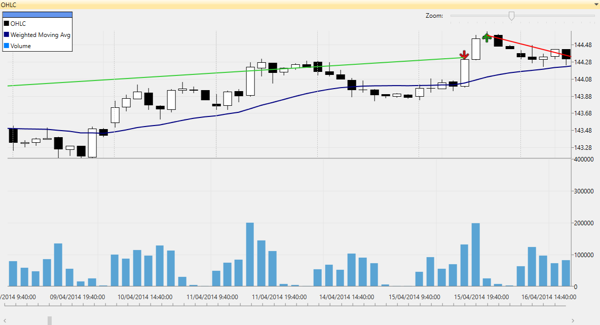
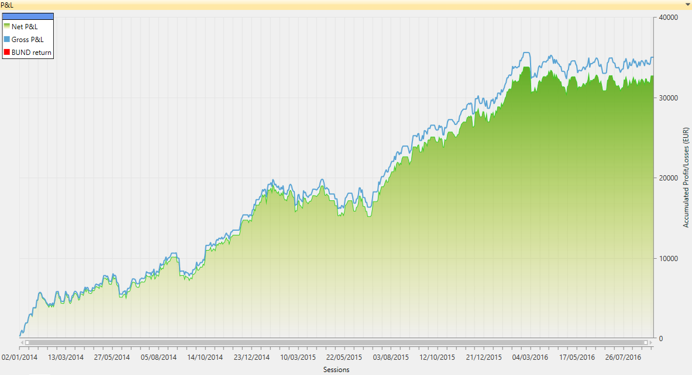

Sansa Trading Strategy
============================================

Table of Contents
----

* [Overview](#overview)
* [Sansa Trading Rules](#Sansa-trading-rules)
* [Download](#download)
* [Quick Start](#quick-start)
* [User Manual](#user-manual)
* [About iSystems](#about-isystems)
* [Disclaimer](#disclaimer)

Overview
----

Sansa is a trading algorithm written in C# using the [TradingMotion SDK] development tools (there is a [VB.net port] too).


<sub>__Image footnote:__ Example of Sansa OHLC financial chart showing some automatic trades</sub>

The strategy code is all contained in [SansaStrategy.cs], including a default parameter combination.

This default parameter combination has been optimized to run over a 100' bars main chart and 120' bars secondary chart of _Euro-Bund Future_.

Trading a maximum of 1 contract of Euro-Bund Future, this is how performed (hypothetically) from 2001 to 2016:


<sub>__Image footnote:__ Hypothetic Net P&L chart for Sansa strategy</sub>

Anyway, go open Visual Studio, clone the project and start with the trading algo development! Sure you can do better and improve all these figures :)

Sansa Trading Rules
----

Sansa's trading plan is quite simple. It __buys 1 contract__ when the weighted moving average short period of seconday chart breaks above the weighted moving average long period of main chart.

While Sansa has a position in the market, it __places two exit orders__. A _Stop Loss_ order and a _Take Profit_. 

### To sum up ###
```
Sansa Trading Strategy rules:

  * Entry: Weighted moving average short period (secondary chart) breaks above the weighted moving average long period (main chart).
  * Exit: Set a fixed Stop Loss and a Take Profit (objective)
  * Filters: None
```

### Show me the code ###

Here is a simplified C# source code of Sansa's _OnNewBar()_ function. The complete code is all contained in [SansaStrategy.cs] along with comments and definition of parameters.

```csharp
var indSlowWma = (WMAIndicator)GetIndicator("Slow WMA");
var indFastWma = (WMAIndicator)GetSecondaryChart(0).GetIndicator("Fast WMA");
            
if (GetOpenPosition() == 0)
{
    //We're flat. Check if current bar contains a golden cross
    if (indFastWma.GetWMA()[0] > indSlowWma.GetWMA()[0] && //Check if Fast weighted moving average is higher than Slow moving average in current bar
        indFastWma.GetWMA()[1] < indSlowWma.GetWMA()[1]) //Check if Fast weighted moving average was lower than Slow moving average in previous bar
    {
        //Going Long (Buying 1 Contract at Market price)
        Buy(OrderType.Market, 1, 0, "Open long position");
        log.Info("Open long position " + Bars.Bars[0].Close);
    }
}

//Place Take-Profit and Stop-Loss orders
PlaceExitOrders();
 
protected void PlaceExitOrders()
{
    if (GetOpenPosition() > 0)
    {
        var ticksTakeProfit = (int)GetInputParameter("Ticks Take-Profit");
        var ticksStopLoss = (int)GetInputParameter("Ticks Stop-Loss");

        var takeProfitLevel = GetFilledOrders()[0].FillPrice + (ticksTakeProfit * Symbol.TickSize);
        var stopLossLevel = GetFilledOrders()[0].FillPrice - (ticksStopLoss * Symbol.TickSize);

        ExitLong(OrderType.Limit, Symbol.RoundToNearestTick(takeProfitLevel), "Take Profit " + takeProfitLevel);
        ExitLong(OrderType.Stop, Symbol.RoundToNearestTick(stopLossLevel), "Stop Loss " + stopLossLevel);
    }
}
```

Download
----

First of all, make sure you have Visual Studio 2010 version (or higher). [TradingMotion SDK] is fully compatible with [Visual Studio Express] free versions.

Download TradingMotion [Visual Studio extension], and the windows desktop application [TradingMotionSDK Toolkit installer].


Quick Start
----

* Create a free account to access TradingMotionAPI (required). It can be created from TradingMotionSDK Toolkit (the desktop application)
* Clone the repository:
```sh
git clone https://github.com/victormartingarcia/sansa-trading-strategy-csharp
```
* Open Visual Studio and load solution _SansaStrategy/SansaStrategy.sln_
* Edit _app.config_ file adding your TradingMotionAPI credentials on _appSettings_ section

And you're all set!

Running the project (F5) will perform a _development backtest simulation_ over last 6 months DAX 60' bars data.

Once it has finished, it will ask if you want to see the P&L report in TradingMotionSDK Toolkit. Pressing 'y' will load the same backtest with the desktop app, where it will show performance statistics, charts, and so on.

User Manual
----

__[More documentation in the Getting Started Guide]__

About iSystems
----

[iSystems] by [TradingMotion] is a marketplace for automated trading systems.

_iSystems_ has partnered with [11 international brokers](http://www.tradingmotion.com/Brokers) (and counting) that offer these trading systems to their clients (both corporate and retail) who pay for a license fee that the developer charges.

The trading systems run with live market data under a controlled environment in iSystems' datacenters.

This way the developers just need to worry about how to make their trading systems better and iSystems platform does the rest.

Visit [Developers] section on TradingMotion's website for more info on how to develop and offer your systems.

Disclaimer
----

I am R&D engineer at [TradingMotion LLC], and head of [TradingMotion SDK] platform. Beware, the info here can be a little biased ;)

  [VB.net port]: https://github.com/victormartingarcia/arya-trading-strategy-vbnet
  [TradingMotion SDK]: http://sdk.tradingmotion.com
  [SansaStrategy.cs]: SansaStrategy/SansaStrategy.cs
  [iSystems platform]: https://www.isystems.com
  [iSystems.com]: https://www.isystems.com
  [iSystems]: https://www.isystems.com
  [TradingMotion LLC]: http://www.tradingmotion.com
  [TradingMotion]: http://www.tradingmotion.com
  [Developers]: http://www.tradingmotion.com/Strategies/Developers
  [Visual Studio Express]: http://www.visualstudio.com/en-us/downloads#d-2010-express
  [TradingMotion SDK website]: http://sdk.tradingmotion.com
  [TradingMotionSDK Toolkit installer]: http://sdk.tradingmotion.com/files/TradingMotionSDKInstaller.msi
  [Visual Studio extension]: http://sdk.tradingmotion.com/files/TradingMotionSDK_VisualStudio.vsix
  [More documentation in the Getting Started Guide]: http://sdk.tradingmotion.com/GettingStarted
